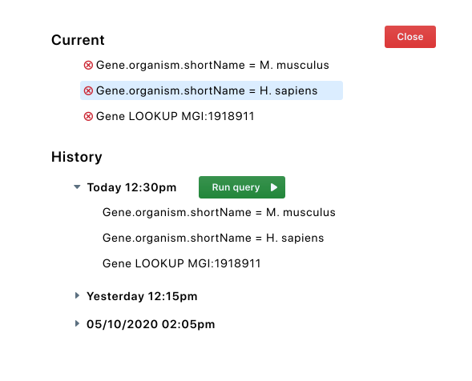
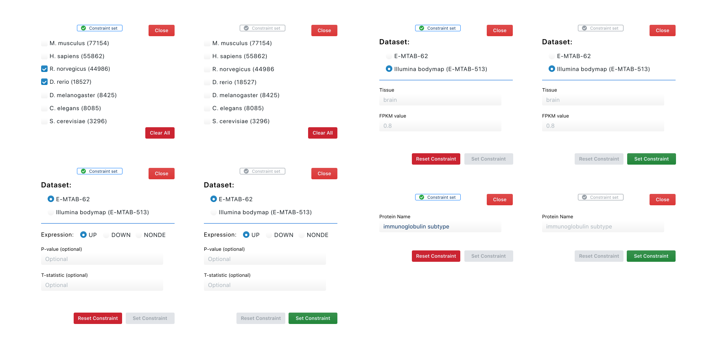
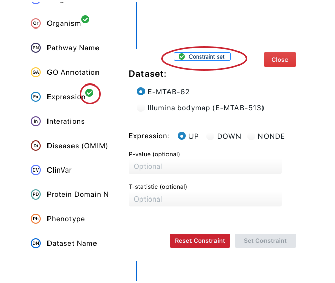

---
html:
  embed_local_images: true
  embed_svg: true
  toc: true

print_background: false
---
<link rel="stylesheet" href="css/lightbox.css">

  
  
#  1. Introduction
  
  
This software  design document describes the architecture and system design for the migration of the intermine data browser from a jquery webapp, to a react/es6 app. It has been developed in coordination with Adrián Rodríguez-Bazaga, and Nikhil Vats, mentors for the May 2020 Outreachy internship round.
  
As of May 25, 2020, this document is to be assumed as being incomplete, pending further discussion.
  
##  1.1. Purpose
  
  
The purpose of this document is to present a description of the re-envisioned UI/UX flow of the application. It will depend on the current designs implemented, and will guide future design decisions. Furthermore, it will serve as a base for future contributors to this project.
  
  
##  1.2. Scope
  
  
This document provides a high level description of how the user will assemble queries, review previous queries, and navigate throughout the data browser.
  
It also specifies the structure and design of the state management solution selected, and the data structures used to support it.
  
#  2. Design Considerations
  
  
##  2.1. Assumptions
  
  
The user of the data browser will understand the terminology, as well as how to analyze the displayed data. Still, the user will not have a complete understanding of the mine's internal data structures, or how to properly structure a query against it.
  
##  2.2. Constraints
  
  
The data browser uses `im-tables`, an external library, to render to the table. This library does not provide any events for us to listen for, or methods to attach to.
  
##  2.3. System Environment
  
  
This application will be accessible only on the web, and will not be mobile responsive. This is due to the current limitations of integrating the external `im-tables` library, which itself is not mobile responsive.
  
##  2.4. Design Methodology
  
  
The application has been designed with an eye towards W3C compliant accessibility. It has also been modeled for ease of adding future mines and query constraints with minimal modifications.
  
It will also make use of the actor model for state management, rather than the unidirectional data flow paradigm found in flux architectures. It will accomplish this with the [xstate library](https://xstate.js.org/docs/ ).
  
The usage of the `xstate` library also will enable easier transitions to different view frameworks, since it is framework agnostic.
  
#  3. Architecture
  
  
##  3.1. System Design
  
  
We maintain separate atoms of state since we have many components, each with its own state that must be synchronized with other components. State will be managed using a finite state machine for each atom, decreasing the occurrence of invalid states. 
  
Since `xstate`'s actors are still immature, and react components are essentially actors themselves, we spawn actors from each component. Atoms have their own private state, and will communicate with each other and the components through the use of an event bus.
  
Each atom will also subscribe itself to the event bus on on instantiation, to ensure it only responds to relevant events.
  
The diagram below demonstrates how 3 react components, `Comp1`, `Comp2`, and `Comp3`, communicate with their respective atoms, `Atom1`, `Atom2`, and `Atom3`.
  
  
 
  
<figure class="zoom">
   
   <figcaption style="width: 100%; text-align: center">
  
   `Comp2` and `Comp3` are both subscribed to the `COMP_3_MESSAGE` event, while `Comp1` is not.
   </figcaption>
</figure>
  
 
  
Because `xstate` prevents invalid states, authentication and query cancelling become much easier to manage without an explosion of boolean flags and switch statements. 
  
`xstate` also comes with a visualizer that facilitates creating and visualizing state charts. Below is a sample visualization. If you would like to play with the visualization yourself, [you can do so here.](https://xstate.js.org/viz/?gist=dae4d6f6837d193ed2149e2e4515e206 )
  
  
<figure class="zoom">
   
   <figcaption style="width: 100%; text-align: center">
   Chart displaying the possible state transitions at each step.
   </figcaption>
</figure>
  
 
  
This is the chart definition for the previous visualization.
  
<figure>
   
   <figcaption style="width: 100%; text-align: center">
   Chart displaying the possible state transitions at each step.
   </figcaption>
</figure>
  
  
#  UI Design
  
  
The user interface should feel inviting to users, both new and loyal. As such, care has been taken to keep the UI as full of space as possible without restricting the flow of information.
  
To achieve this goal, the application will be designed according to these principles:
  
1. **The every user matters principle**: since this application is data heavy and requires the usage of reading charts, we first and foremost strive to achieve the W3C keyboard accessibility standards. Throughout we shall also keep in mind users with poor sight, and as such adhere as close as possible to users who require text dictation.
  
2. **The simplicity principle**: It should *always* be clear what actions can be taken at each step of the flow. Users should **not** be allowed to bring the application to an invalid state. If they do, clear error messages and guidance shall be provided.
  
3. **The repetition is key principle**: Information should be presented in every relevant location. This means that sometimes information may be duplicated, for instance within a modal. This is desirable as the user should not have to hunt for information that should be readily available.
  
4. **The reuse principle**: Similar operations should look and behave the same. As such, components and patterns are reused as much as possible. 
  
##  UI Mockups
  
  
The following images describe ideal workflow states for the user.
  
###  Full Application
  
<figure class="zoom">
   
   <figcaption style="width: 100%; text-align: center">
   Image of the full application
   </figcaption>
</figure>
  
###  History Component
  
  
This mockup displays how we'll present the user a history, so that they will always know the current query, as well as repeat previous ones.
  
<figure class="zoom">
   
   <figcaption style="width: 100%; text-align: center">
   History Component
   </figcaption>
</figure>
  
##  Examples of Reuse
  
  
This next mockup demonstrate consistency in thematic elements...
  
<figure class="zoom">
   
   <figcaption style="width: 100%; text-align: center">
   Side by side comparisons to demonstrate reusing concepts.
   </figcaption>
</figure>
  
 
  
  
and this mockup demonstrates placing information in multiple locations.
<figure class="zoom">
   
   <figcaption style="width: 100%; text-align: center">
   Information is placed in multiple locations to assist the user.
   </figcaption>
</figure>
  