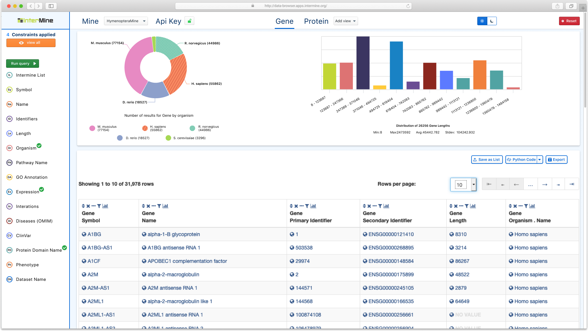

---
html:
  embed_local_images: true
  embed_svg: true
  toc: true

print_background: false
---
<link rel="stylesheet" href="css/lightbox.css">

  
  
#  1. Introduction
  
  
This software design document is for the migration of the intermine data browser to a react/es6 app. It describes the architecture and system design used in that process.

It was formulated by John Mendez alongside Adrián Rodríguez-Bazaga, and Nikhil Vats, mentors for the May 2020 Outreachy internship round.
  
##  1.1. Purpose
  
  
The document presents a description of the re-envisioned UI/UX flow of the application. It relies on the current designs implemented, and will guide future design decisions. Furthermore, it will serve as a base for future contributors to this project
  
  
##  1.2. Scope
  
  
This document provides a high level description for how the user will:

1. assemble queries
2. review previous queries
3. navigate throughout the data browser.
  
It also details the data structures used to support the design of state management.
  
#  2. Design Considerations
  
  
##  2.1. Assumptions
  
The user of the app will understand the terminology, as well as how to analyze the displayed data. Yet they will not have a complete understanding of the mine's internal data structures, or structuring a query against it.
  
##  2.2. Constraints
  
  
The data browser uses `im-tables`, an external library, to render to a table. This library does not provide any events for us to listen for, or methods to attach to.
  
##  2.3. System Environment
  
  
Currently `im-tables` is not mobile responsive. As such, this application will be accessible only on the web, and will not be mobile responsive.
  
##  2.4. Design Methodology
  
The design of the application maintains an eye towards W3C compliant accessibility. The features are being modeled for ease of adding future mines and query constraints with minimal modifications.

State management will adhere to the actor model. This is in contrast to the unidirectional data flow paradigm found in flux architectures. It will do so using the [xstate library](https://xstate.js.org/docs/ ).

The `xstate` library is also framework agnostic. Thus, future refactors into other view frameworks can reuse the same logic.
  
#  3. Architecture
  
  
##  3.1. System Design
  
  
To maintain synchronization between many components, we will use individual finite state atoms. One for each relevant component. This decreases the occurrence of invalid states due to missed edge cases. It improves the efficiency of development, by allowing one to focus on small, independent components.
  
Since `xstate`'s actors are still immature, and react components are actors themselves, we spawn actors from each component. As atoms have their own private state, they will communicate with other atoms and components through the use of an event bus.
  
Each atom will subscribe itself to the event bus on instantiation, to ensure it only responds to relevant events.
  
The diagram below demonstrates how 3 react components—`Comp1`, `Comp2`, and `Comp3`—communicate with their respective atoms—`Atom1`, `Atom2`, and `Atom3`.
  
  
 
  
<figure class="zoom">
   
   <figcaption style="width: 100%; text-align: center">
  
   `Comp2` and `Comp3` are both subscribed to the `COMP_3_MESSAGE` event, while `Comp1` is not.
   </figcaption>
</figure>
  
 
  
Because `xstate` prevents invalid states, authentication and query cancelling become easier to manage. We can do so declaratively without an explosion of boolean flags and switch statements.
  
`xstate` also comes with a visualizer that facilitates creating and visualizing state charts. Below is a sample visualization. If you would like to play with the visualization yourself, [you can do so here.](https://xstate.js.org/viz/?gist=dae4d6f6837d193ed2149e2e4515e206 )
  
  
<figure class="zoom">
   
   <figcaption style="width: 100%; text-align: center">
   Chart displaying the possible state transitions at each step.
   </figcaption>
</figure>
  
 
  
This is the chart definition for the previous visualization.
  
<figure>
   
   <figcaption style="width: 100%; text-align: center">
   Chart displaying the possible state transitions at each step.
   </figcaption>
</figure>

## Overcoming constraints

Since the `im-tables` library does not provide methods or events back to us that we can use to control rendering, we instead hijack the DOM using react. When the table initially loads into the DOM, we replace the relevant sections with react components. This way we are in full control of adding or removing constraints.
  
#  UI Design
  
  
The user interface should feel inviting to users, both new and loyal. At each step keeping the UI as full of space as possible without restricting the flow of information.
  
To achieve this goal, the application is designed according to these principles:
  
1. **The every user matters principle**:  this application is data heavy, dense, and requires reading charts. So at the least we strive to achieve the W3C accessibility standards.

2. **The simplicity principle**: It should *always* be clear what actions the user can take at each step of the flow. We will prevent the user from bringing the application to an invalid state. If they do, we display clear error messages and guidance.
  
3. **The repetition is key principle**: present information in every relevant location. This means sometimes duplicating it, for instance within a modal. The user should not have to hunt for information that should be readily available.
  
4. **The reuse principle**: Similar operations should look and behave the same. As such, reuse components and patterns as much as possible. 
  
##  UI Mockups
  
  
The following images describe ideal workflow states for the user.
  
###  Full Application
  
<figure class="zoom">
   
   <figcaption style="width: 100%; text-align: center">
   Image of the full application
   </figcaption>
</figure>
  
###  History Component
  
  
The history component informs the user on their current query, as well as giving them the opportunity to run previous ones.
  
<figure class="zoom">
   
   <figcaption style="width: 100%; text-align: center">
   History Component
   </figcaption>
</figure>
  
##  Examples of Reuse
  
  
This following mockups demonstrate consistency in thematic elements...
  

  
 
  
  
and this mockup demonstrates placing information in multiple locations.
<figure class="zoom">
   
   <figcaption style="width: 100%; text-align: center">
   Information is placed in multiple locations to assist the user.
   </figcaption>
</figure>
  